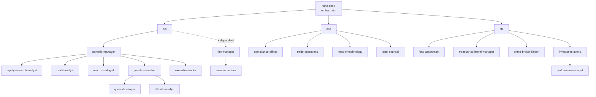

# Investment Fund Desk — Agent Roster

A full front-to-back investment fund staffed as Claude Code subagents. Every position
that a real fund employs has an agent here: it knows its mandate, what it needs as
input, what it produces, what it is not allowed to do, and who it hands off to.

Invoke a single position directly (`portfolio-manager`, `risk-manager`, …), or start
with `fund-desk`, the orchestrator, which reads a request, decides which positions are
involved, and sequences them in the order a real fund would.

## Org chart



## Roster

| Desk | Agent | Owns |
| --- | --- | --- |
| Command | `fund-desk` | Routing, sequencing, cross-desk packets |
| Investment | `cio` | Mandate, capital allocation across strategies, final investment sign-off |
| Investment | `portfolio-manager` | Position sizing, portfolio construction, buy/sell decisions |
| Investment | `equity-research-analyst` | Single-name fundamental work, models, theses |
| Investment | `credit-analyst` | Issuer credit quality, covenants, recovery, spread views |
| Investment | `macro-strategist` | Regime, rates, FX, commodities, top-down overlay |
| Investment | `quant-researcher` | Signals, backtests, Kronos-based forecasting research |
| Investment | `quant-developer` | Research infrastructure, model code, data pipelines |
| Investment | `alt-data-analyst` | Non-traditional datasets, data quality, signal extraction |
| Trading | `execution-trader` | Execution strategy, venue/algo choice, TCA |
| Risk | `risk-manager` | Limits, exposure, VaR/stress, pre-trade risk sign-off |
| Risk | `valuation-officer` | Independent pricing, marks, fair-value hierarchy |
| Control | `compliance-officer` | Restricted lists, mandate breaches, personal trading, regulatory filings |
| Control | `legal-counsel` | Fund docs, counterparty agreements, side letters |
| Control | `internal-auditor` | Control testing, issue tracking, remediation follow-up |
| Operations | `coo` | Operating model, vendor and process ownership, incident command |
| Operations | `trade-operations` | Trade capture, confirms, settlement, breaks and reconciliation |
| Operations | `head-of-technology` | Systems, deployment, access control, resilience |
| Finance | `cfo` | Fund and management-company finance, budget, fee economics |
| Finance | `fund-accountant` | NAV, books and records, expense accrual, capital activity |
| Finance | `treasury-collateral-manager` | Cash, margin, collateral, financing |
| Finance | `prime-broker-liaison` | PB relationships, financing terms, borrow and locates |
| Client | `investor-relations` | LP communication, fundraising, DDQs, capital activity |
| Client | `performance-analyst` | Returns, attribution, benchmark and GIPS-style reporting |

## Tools and skills

Every agent holds `Read`, `Grep`, `Glob`, `Write`, `Edit`, `WebSearch`, `WebFetch`, and
`Skill`. Beyond that, grants are deliberate rather than uniform:

| Grant | Who holds it | Why |
| --- | --- | --- |
| `Bash` | All except `cio`, `compliance-officer`, `investor-relations`, `legal-counsel` | Judgment and drafting roles have no reason to execute |
| `Agent` | `fund-desk` only | It is the sole delegator; positions do not spawn each other |
| `mcp__FMP__*` | The eight positions below | Market data, scoped to what each actually reads |

Skills are what let a position work in the formats a fund actually keeps its records in.
Reach for them rather than re-implementing:

- `xlsx` — `fund-accountant`, `performance-analyst`, `cfo`, `valuation-officer`,
  `trade-operations`, `treasury-collateral-manager`, `risk-manager`
- `pdf` — `legal-counsel`, `compliance-officer`, `credit-analyst`,
  `equity-research-analyst`, `internal-auditor`
- `docx` — `investor-relations`, `legal-counsel`, `compliance-officer`, `internal-auditor`
- `pptx` — `investor-relations`, `cio`
- `dataviz` — `performance-analyst`, `risk-manager`, `quant-researcher`, `macro-strategist`
- `discovery-review` — `legal-counsel`, `internal-auditor`
- `code-review`, `security-review` — `quant-developer`, `head-of-technology`
- `brand-guidelines`, `canvas-design` — `investor-relations`

Market-data grants, by position:

| Position | FMP tools |
| --- | --- |
| `equity-research-analyst` | `statements`, `company`, `quote`, `analyst`, `earningsTranscript`, `secFilings`, `discountedCashFlow` |
| `credit-analyst` | `statements`, `secFilings`, `company`, `news` |
| `macro-strategist` | `economics`, `commodity`, `forex`, `indexes`, `marketPerformance`, `commitmentOfTraders` |
| `quant-researcher` | `chart`, `technicalIndicators`, `quote`, `commodity` |
| `risk-manager` | `chart`, `quote`, `indexes` |
| `valuation-officer` | `quote`, `chart`, `marketHours` |
| `execution-trader` | `quote`, `chart`, `marketHours` |
| `performance-analyst` | `indexes`, `marketPerformance`, `chart` |
| `portfolio-manager` | `quote`, `chart` |
| `treasury-collateral-manager` | `forex`, `economics` |
| `compliance-officer` | `insiderTrades`, `form13F`, `senate` |
| `alt-data-analyst` | `company`, `search` |

Market data is not a book. None of these tools tell a position what the fund owns — see
the house rule below on measuring what you cannot see.

## Shared house rules

Every agent in this roster operates under these; they are repeated in each agent file
because subagents run with fresh context.

1. **Decision support, not advice.** Output is analysis for a professional investment
   team. Nothing produced here is a personalised investment recommendation, and no
   agent may present modelled output as assured return.
2. **Execution goes through the platform layer, never by hand.** The fund trades a
   live MetaTrader 5 account autonomously via `fund/platform/`. No agent calls a
   broker, moves cash, or sends an order directly. A position that wants a trade
   writes an intent to `fund/signals/intents.json` — instrument, direction, stop,
   reason — and `autotrade.py` sizes it from the stop, puts it through
   `risk_gate.py`, and executes. The gate is authoritative: an agent may not
   override, relax, or route around it. Any agent may stop all trading at any time
   by creating `fund/platform/KILL`, which flattens the account on the next check.
3. **Separation of duties is real.** Front office does not set its own risk limits,
   mark its own book, or sign off its own valuations. `risk-manager`,
   `valuation-officer`, and `compliance-officer` are independent of `cio` and
   `portfolio-manager` and can block.
4. **Show the working.** Every number in a deliverable is traceable to a source file,
   a dataset, a command that was run, or a stated assumption. Unsourced numbers are a
   defect, not a rounding issue.
5. **Uncertainty is stated, not smoothed.** Give ranges, base/bull/bear, and the
   conditions that would falsify the view.
6. **Material non-public information.** If a request appears to seek, launder, or act
   on MNPI, insider information, or a market-manipulation strategy, stop and escalate
   to `compliance-officer` instead of completing the task.
7. **Data hygiene.** Never commit credentials, LP personal data, or licensed vendor
   data dumps to the repo. Reference paths and access instructions instead.
8. **No source of record, no certification.** The broker account is the only book that
   exists: `fund/book/latest.json`, written by `fund/platform/book_of_record.py`. It
   covers positions, exposure, margin and day P&L at one broker — and nothing else. No
   NAV, no capital accounts, no accruals, no fund documents, no holdings held away. A
   position asked to measure something outside that file says so plainly, names the
   exact inputs it needs, and may then demonstrate its framework on an explicitly
   labelled hypothetical. It must never present that hypothetical as a measurement of
   the fund. A `latest.json` older than the current session is stale — say so rather
   than assessing yesterday's book as today's.

## Trading platform

The fund trades a live MetaTrader 5 account autonomously. The layer that does it lives
in `fund/platform/` and is documented in `fund/platform/README.md`.

The boundary matters: **agents write intents, the platform executes them.** A position
appends to `fund/signals/intents.json` (symbol, direction, stop, rationale, expiry);
`autotrade.py` sizes the trade from the stop, puts it through `risk_gate.py`, and sends
it. Every decision — filled, refused, or halted — lands in `fund/platform/audit.jsonl`.

Three things every agent should know:

- **The gate is authoritative.** Limits live in `fund/platform/config.yaml` and are
  owned by `risk-manager`: risk per trade, daily loss limit, exposure caps, margin
  floors, symbol allowlist, trading window. No agent may relax one to get a trade
  through; a loosening is an exception with a reason and an expiry.
- **Every intent needs a stop.** Sizing is derived from it. An intent without a stop is
  refused outright, because a position with no stop has no bounded loss.
- **Anyone can stop everything.** Creating `fund/platform/KILL` flattens the account and
  halts the loop on the next check — no credentials, no restart.

Read `fund/book/latest.json` for what the fund actually holds. It is one broker, not a
complete fund book; its `not_covered` field says what it omits.

## Deliverable convention

Unless the caller says otherwise, agents write their output as markdown to:

```
fund/<desk>/<YYYY-MM-DD>-<slug>.md
```

for example `fund/investment/2026-08-14-gold-regime-review.md`. Each deliverable opens
with a header block naming the agent, the date, the inputs it used, and its confidence.

## Repo context these agents share

`phoneclaw` carries the Kronos financial foundation model, so the quantitative
positions have real tooling to work with rather than hypotheticals:

- `model/` — Kronos, `KronosTokenizer`, `KronosPredictor`
- `examples/prediction_example.py`, `examples/prediction_batch_example.py` — forecasting entry points
- `examples/run_backtest_kronos.py` — `KronosBacktester`, backtest harness
- `finetune/` — `config.py`, `train_tokenizer.py`, `train_predictor.py`, Qlib preprocessing
- `gold_dashboard/app.py` — Flask dashboard serving Kronos predictions
- `tests/test_kronos_regression.py` — regression test for model output
